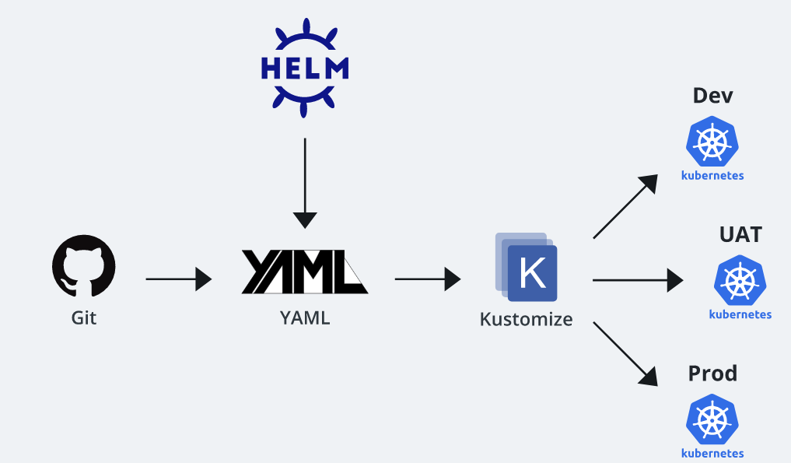

# kustomize
Patching k8s Yaml Files


## To recap, Kustomize relies on the following system of configuration management layering to achieve reusability:

## Base Layer
```
Specifies the most common resources
```

## Patch Layers
```
Specifies use case specific resources
```

# Basic Flow (Kustomize works with Git and Helm to make the continuous delivery pipeline easier to configure)



## Kustomize Features
* Kustomize is often used in conjunction with Helm as described above, and it's been embedded in Kubernetes since its March 2019 release of version 1.14 (invoked by the command apply -k).

* Kustomize offers the following valuable attributes:
    *   Kubectl Native
        *   No need to install or manage as a separate dependency
    *   Plain Yaml
        *   No complex templating language
    *   Declarative
        *   Purely declarative (just like Kubectl)
    *   Multiple Configurations
        *   Manages any number of different configurations

Functionality |	# Kustomize | # Native Helm | #	Native Kubectl  |
------------- | --------- | ---------- | ---------------- |
Templating	| No templating |	Complex templating |	No templating |
Setup | No separate setup | Needs setup	No separate setup|
Configuration | Manage multiple configurations with one base file | Manage multiple configurations with one base file |	Should have separate files for each different configuration |


## Benefits of Using Kustomize:
1. Reusability
Kustomize allows you to reuse one base file across all of your environments (development, staging, production) and then overlay unique specifications for each.

2. Fast Generation
Since Kustomize has no templating language, you can use standard YAML to quickly declare your configurations.

3. Easier to Debug
YAML itself is easy to understand and debug when things go wrong. Pair that with the fact that your configurations are isolated in patches, and you’ll be able to triangulate the root cause of performance issues in no time. Simply compare performance to your base configuration and any other variations that are running.


## Kubernetes Example
* Let’s step through how Kustomize works using a deployment scenario involving 3 different environments: dev, staging, and production.
* In this example we’ll use service, deployment, and horizontal pod autoscaler resources. 
* For the dev and staging environments, there won't be any HPA involved. All of the environments will use different types of services:
        
    * Dev
         * ClusterIP
    * Staging
        * NodePort
    * Production
        * LoadBalancer

* They each will have different HPA settings. This is how directory structure looks:
```
├── base
│   ├── deployment.yaml
│   ├── hpa.yaml
│   ├── kustomization.yaml
│   └── service.yaml
└── overlays
    ├── dev
    │   ├── hpa.yaml
    │   └── kustomization.yaml
    ├── production
    │   ├── hpa.yaml
    │   ├── kustomization.yaml
    │   ├── rollout-replica.yaml
    │   └── service-loadbalancer.yaml
    └── staging
        ├── hpa.yaml
        ├── kustomization.yaml
        └── service-nodeport.yaml
```

## base/deployment.yaml 

```
apiVersion: apps/v1
kind: Deployment
metadata:
  name: frontend-deployment
spec:
  selector:
  matchLabels:
    app: frontend-deployment
  template:
  metadata:
    labels:
      app: frontend-deployment
  spec:
    containers:
    - name: app
      image: foo/bar:latest
      ports:
      - name: http
        containerPort: 8080
        protocol: TCP

```

## base/service.yaml

```
apiVersion: v1
kind: Service
metadata:
  name: frontend-service
spec:
  ports:
  - name: http
    port: 8080
  selector:
  app: frontend-deployment

```

## base/hpa.yaml

```
apiVersion: autoscaling/v2beta2
kind: HorizontalPodAutoscaler
metadata:
  name: frontend-deployment-hpa
spec:
  scaleTargetRef:
  apiVersion: apps/v1
  kind: Deployment
  name: frontend-deployment
  minReplicas: 1
  maxReplicas: 5
  metrics:
  - type: Resource
  resource:
    name: cpu
    target:
      type: Utilization
      averageUtilization: 50

```

## base/kustomization.yaml
```
apiVersion: kustomize.config.k8s.io/v1beta1
kind: Kustomization

resources:
  - service.yaml
  - deployment.yaml
  - hpa.yaml
  
```

## dev/kustomization.yaml
```
apiVersion: kustomize.config.k8s.io/v1beta1
kind: Kustomization
bases:
- ../../base
patchesStrategicMerge:
- hpa.yaml

```


## dev/hpa.yaml

```apiVersion: autoscaling/v2beta2
kind: HorizontalPodAutoscaler
metadata:
  name: frontend-deployment-hpa
spec:
  minReplicas: 1
  maxReplicas: 2
  metrics:
  - type: Resource
  resource:
    name: cpu
    target:
      type: Utilization
      averageUtilization: 90


```
